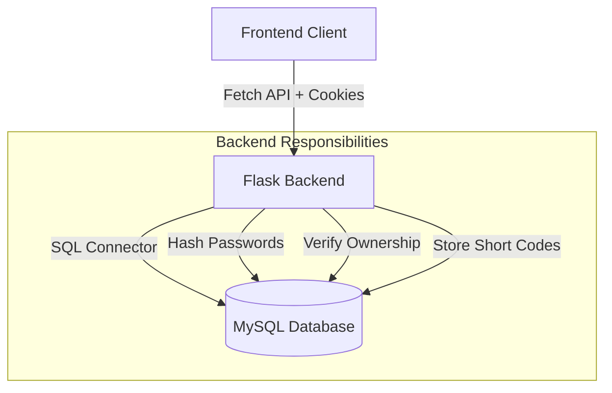

<div align="center">

# 🔗 Shortly

### Authenticated URL Shortener


**A full-stack URL shortening service with user authentication.**
*Built to understand backend fundamentals, security tradeoffs, and data ownership.*

</div>

---

## 📖 About The Project

**Shortly** is a focused learning project designed to explore how a real backend system is structured end-to-end. Rather than being an anonymous redirect tool, the system emphasizes **user ownership of data**—every shortened URL is tied to an authenticated account and governed by access rules.

### Design Philosophy

* **Session-Based Authentication**
  Server-side sessions were chosen instead of JWTs to gain hands-on experience with cookie security, session invalidation, and server-managed state.

* **Clear Separation of Concerns**
  HTTP request handling (`app.py`) and persistence logic (`db.py`) are intentionally separated to keep business logic testable and maintainable.

* **Defensive Access Control**
  All URL operations are ownership-checked at the database level to prevent horizontal privilege escalation.

---

## ✨ Features

| Category           | Capability                                                       |
| ------------------ | ---------------------------------------------------------------- |
| **Authentication** | User registration, login, logout, and secure session handling    |
| **URL Shortening** | Collision-resistant short-code generation                        |
| **User Ownership** | Per-user URL history and delete permissions                      |
| **Metadata**       | Automatic page-title extraction (gracefully degrades on failure) |
| **Security**       | Password hashing with Werkzeug, CORS with credentials            |

---

## 🧱 Tech Stack

### Backend

* **Language:** Python
* **Framework:** Flask
* **Database:** MySQL (`mysql-connector-python`)
* **Authentication:** Server-side sessions (secure cookies)
* **Utilities:** BeautifulSoup4, Requests, Werkzeug

### Frontend

* **Markup & Style:** HTML5, CSS3
* **Logic:** Vanilla JavaScript
* **Networking:** Fetch API (`credentials: include`)

---

## 🏗️ Architecture



The backend acts as the sole authority for authentication, authorization, and data validation. The frontend remains stateless and relies entirely on session cookies.

---

## 📡 API Reference

### Authentication

| Method | Endpoint        | Description                          |
| ------ | --------------- | ------------------------------------ |
| POST   | `/api/register` | Register a new user                  |
| POST   | `/api/login`    | Authenticate user and create session |
| POST   | `/api/logout`   | Destroy session and log out          |

### URL Management

| Method | Endpoint         | Description                        |
| ------ | ---------------- | ---------------------------------- |
| POST   | `/api/shorten`   | Create a short URL (auth required) |
| GET    | `/api/urls`      | Fetch user-owned URLs              |
| DELETE | `/api/urls/<id>` | Delete URL (ownership enforced)    |

### Redirection

| Method | Endpoint        | Description                 |
| ------ | --------------- | --------------------------- |
| GET    | `/<short_code>` | Redirect or show custom 404 |

---

## 🗄️ Database Schema

### `users`

* `id` (PK) — Integer, auto-increment
* `username` — VARCHAR, unique
* `password_hash` — VARCHAR, securely stored
* `created_at` — Timestamp

### `dmforlink`

* `id` (PK) — Integer, auto-increment
* `original` — TEXT (original URL)
* `short_code` — VARCHAR, unique
* `link_name` — VARCHAR (scraped title)
* `user_id` (FK) — References `users.id` (cascade delete)
* `created_at` — Timestamp

---

## ⚙️ Local Setup

### 1. Clone the Repository

```bash
git clone <your-repo-url>
cd url-shortener
```

### 2. Configure Environment

Create a `.env` file in the project root:

```env
DB_HOST=localhost
DB_USER=your_user
DB_PASSWORD=your_password
DB_NAME=url_shortner
FLASK_SECRET_KEY=generate_a_strong_random_key
```

### 3. Initialize Database

```sql
SOURCE database.sql;
```

### 4. Install Dependencies

```bash
pip install flask flask-cors mysql-connector-python python-dotenv requests beautifulsoup4
```

### 5. Run the Application

**Backend**

```bash
python app.py
```

**Frontend**
Serve `index.html` using a local static server (e.g. VS Code Live Server).

---

## 🚧 Limitations & Roadmap

This project focuses on correctness over scale. Current limitations include:

* [ ] **Rate Limiting** — Currently vulnerable to abuse.
* [ ] **Async Jobs** — Metadata fetching is synchronous (blocks request).
* [ ] **CSRF Protection** — Standard token protection is planned.
* [ ] **HTTPS** — Production deployment would enforce HTTPS.
* [ ] **Scalability** — Short code generation is probabilistic.

---

## 🎯 Learning Outcomes

This project demonstrates understanding of:

* HTTP request lifecycles and RESTful design
* Session-based state management
* Relational database modeling with foreign keys
* Secure password storage and access control enforcement
* Clean separation between transport, logic, and persistence layers
